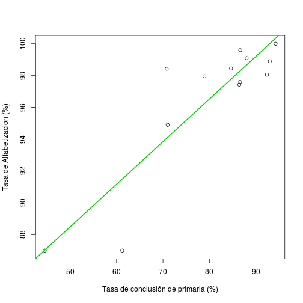

Ejercicios de programación IV: Gráficos y estadística
=====================================================

### [IMSER 2013]

- - -

Archivos incluidos:
-------------------

El [archivo](http://goo.gl/eFUKY) con los ejercicios del práctico debe bajarse y descomprimirse en disco duro, creando la carpeta **`rep-X`** (nota: no debe dentro de ningún disco, partición o carpeta protegida a la escritura, como puede ser un disco duro externo de backup). Usted deberá abrir el RStudio y seleccionar dicha carpeta como su directorio de trabajo con `setwd` o en RStudio la combinación **Ctrl + Shift + K**. En esta carpeta se encuentran algunos archivos que usted deberá modificar:

* **` xxxx.R `**

Adicionalmente los siguientes archivos son necesarios, pero **no deben ser modificados** para que el método de calificación automático funcione correctamente.

* ` evaluar.R `
* ` notas.csv `
* ` datos `
* ` INSTRUCCIONES.pdf `

Mecanismo de corrección:
------------------------

Nota: más recomendaciones **importantes** se hacen en el documento [Dinámica de los repartidos](http://goo.gl/P5Wnq).

Lo primero que debe hacer es cargar el archivo evaluar.R con la función `source` y la codificación de caracteres "UTF-8" (lo cual afecta a la función `evaluar` en particular), de la siguiente manera:


```r
source("evaluar.R", encoding = "utf-8")
```


Si usted ha ejecutado todos los pasos anteriores correctamente, al usar el comando `ls()` verá que `"evaluar"` figura en su sesión y además en la consola debería ver lo siguiente:

    Los siguientes caracteres deben ser vocales con acento:
      á - é - í - ó - ú
    Si no se ven correctamente corra el siguiente comando:
      source('evaluar.R', encoding = 'UTF-8')

Usted trabajará modificando los contenidos de los archivos de los ejercicios con RStudio (u otro programa de su preferencia) según las consignas que se describen a continuación. Luego de terminar cada ejercicio y **guardando el archivo** correspondiente en el disco duro, usted podrá verificar rápidamente si su respuesta es correcta ejecutando el comando:


```r
evaluar()
```


y además podrá en todo momento verificar su puntaje con la función `verNotas()`. Tenga siempre en cuenta que, a **menos que sea indicado** por la letra del ejercicio, las soluciones deben ser genéricas y por lo tanto deben servir aún si se modifican los datos originales (i.e.: no use valores fijos si no comandos). Usualmente se utilizan valores generados de forma aleatoria para las correcciones automáticas. Los objetos que son evaluados en la corrección automática estarán indicados con un asterísco en las instrucciones de cada script. Nótese además que en los archivos **se indica claramente en dónde se inicia y dónde finaliza su código** y que debe respetar esta organización para que la corrección de los ejercicios funcione bien.

### Al finalizar

Una vez terminados y guardados los archivos de los ejercicios del repartido, usted deberá ejecutar `evaluar()` y seleccionar la última opción ("Todos") y luego subir el archivo ”datos” (sin extensión), incluido en la carpeta ”rep-1”, a la [sección de entregas](http://eva.universidad.edu.uy/mod/assign/view.php?id=103966) de la portada del curso en la plataforma EVA. Este archivo se podrá reemplazar con uno más nuevo, en caso de que desee corregir algún error; en caso de querer que el archivo sea corregido antes de la fecha de entrega, puede cambiarle el nombre a "datos-finalizado", pero en ese caso la nota no se cambiará de ahí en adelante.


### Código de Honor

Si bien animamos a que trabaje en equipos y que haya un intercambio fluido en los foros del curso, es fundamental que las respuestas a los cuestionarios y ejercicios de programación sean fruto del trabajo individual. En particular, consideramos necesario que no utilice el código creado por sus compañeros, si no que debe programar sus propias instrucciones, ya que de lo contrario supone un sabotaje a su propio proceso de aprendizaje. Esto implica también evitar, en la medida de lo posible, exponer el código propio a sus colegas. Como profesores estamos comprometidos a dar nuestro mayor esfuerzo para dar las herramientas y explicaciones adecuadas a fin de que pueda encontrar su propio camino para resolver los ejercicios.

En casos de planteos de dudas a través del foro, en los que considere que es imposible expresar un problema sin exponer su própio código, entonces es aceptable hacerlo. De todas formas en estos casos es preferible que envíe su código por correo electrónico directamente a un profesor, explicando la problemática.

- - -


1. Distribución de funciones
----------------------------

El data.frame "Pacientes" presenta dos columnas, con datos obtenidos de 100 pacientes consultados: por un lado (col. 1) la el número de consultas médicas por año y por otro (col. 2) la frecuencia obtenida para ese valor (i.e.: la cantidad de veces que ese número fue respondido). Por lo tanto, podemos observar por ejemplo que XX personas consultadas concurren una vez por año médico. Si vemos el histograma de la segunda variable (`barplot(pacientes[, 2])`) para conocer la distribución del evento podemos observar que la cantidad de pacientes que visitan al medico anualmente puede ser descrito por una FDP del tipo Poisson.

Recuerde que la distribución de probabilidad de Poisson presenta como única variable a $\lambda$ que es la media y la varianza de la FDP. Para mayores consultas busque en la ayuda `?dpois`.

Se desea conocer cual es el máximo valor de $\lambda$ para el rango de valores dado. Este valor obtenido del parámetro será el que maximice la densidad de datos de los pacientes. (???)

Para esto primero debe realizar una función genérica que permita calcular la densidad de probabilidad para cada dato.
Esta función se llama `dpois.pacientes`. Note que se transforman los datos con el logaritmo natural debido a que es mas sencillo calcular el máximo de un número.

Luego se debe definir el argumento lambda de la función `dpois.pacientes`, el cual es una secuencia de valores de dicho parámetro. Esto servirá para conocer cuál es el máximo valor esperado de pacientes por año que concurre al médico. Para esto último recomendamos utilizar y consultar en la ayuda la función `sapply`.

previamente el estudiante deberá importar la tabla pacientes, la cual será un data.frame con el mismo nombre.


densidad: densidad de probabilidad para cada dato $x_i$ que se distribuye con una función de probabilidad tipo Poisson.
transformado: logaritmo natural de los valores de densidad obtenidos.
promedio: promedio de todos los valores transformados. Observe que esta función debe ser negativa para que los valores sean positivos.
`max.lambda`: valor de lambda para el cual es máxima la función `dpois.pacientes`. Los valores de lambda debe estar comprendidos entre 1 y 4.


```r
npac <- 5000
true.lambda <- 4
respuestas <- rpois(npac, true.lambda)

pacientes <- data.frame(A = as.numeric(names(table(respuestas))), B = as.numeric(table(respuestas)))
barplot(pacientes[, 2])
```

 

```r

lambda.min <- 1
lambda.max <- 8

pacientes <- read.table("pacientes.csv", header = TRUE, sep = ",")
```

```
## Warning: no fue posible abrir el archivo 'pacientes.csv': No such file or
## directory
```

```
## Error: no se puede abrir la conexión
```

```r

dpois.pacientes <- function(lambda) {
    
    densidad <- dpois(pacientes[, 1], lambda)
    transformado <- log(densidad)
    promedio <- -mean(transformado)
    
}

dpois.pacientes <- function(lambda) {
    
    densidad <- dpois(pacientes[, 1], lambda)
    dens.obs <- pacientes[, 2]/sum(pacientes[, 2])
    transformado <- log(densidad)
    trans.obs <- log(dens.obs)
    promedio <- -mean(transformado - trans.obs)
    
}

max.lambda <- max(sapply(lambda.min:lambda.max, dpois.pacientes))
```


1. Campeonato de Magic
----------------------

El juego [Magic: el encuentro](https://es.wikipedia.org/wiki/Magic:_el_encuentro), popular entre muchos jóvenes aficionados a los generos literarios de fantasía y los juegos de rol, congrega campeonatos mundiales regularmente. Pensando en estos campeonatos, creamos una data.frame de datos ficticios de los participantes. Para a agregar a su sesión de R una data.frame llamada `magic` con dichos datos, ejecute:


```r
source("hacemagia.R")
```


A partir de esta data.frame haremos varios análisis sencillos y algunos gráficos correspondientes.

### 1.a Variable "genero"

La variable `genero` de la data.frame presenta los valores 1 y 2. Transforme esta variable en factor y luego modifique los nombres de los niveles del mismo a `"mujer"` y `"hombre"` (correspondientes a los valores originales 1 y 2 respectivamente). 

Por ejemplo, la variable original:


```r
> magic$genero[1:4]
[1] 1 2 1 2
```


... y la variable modificada:


```r
> magic$genero[1:4]
[1] mujer  hombre mujer  hombre
Levels: mujer hombre
```


### 1.b Histogramas

Aquí debe hacer un gráfico como el de la figura 1. Se trata de dos histogramas de los valores de alturas de los participantes, separados por sexo. En el histograma de arriba se encuentran las alturas de las mujeres, y de los hombres en el de abajo. Para lograr este gráfico hay que comprender al menos dos comandos:

#### i. función `par` 

Con la función `par` se pueden determinar la cantidad de gráficos que vamos a tener dentro de cada figura. Para eso se usa alguno de los parámetros `mfcol` o `mfrow` (no al mismo tiempo). Utilice estos parámetros correctamente para lograr dividir la figura en dos gráficos tal como en el ejemplo.

 


#### ii. función `hist`

Con la función `hist` usted puede graficar rápidamente un histograma en R. En este caso tiene que utilizar los valores de altura, pero recuerde **separar por hombres y mujeres** antes de hacer los dos histogramas. Por otro lado debe fijar la cantidad de celdas/breaks en *15*, utilizando el argumento correcto de la función. Es posible que en la figura final este número no coincida con la cantidad de barras, ya que actúa tan sólo como una sugerencia para `hist`.

### 1.c Gráfico de cajas

En este ejercicio simplemente vamos a graficar utilizando los argumentos que editan los títulos de los gráficos. La idea es hacer un gráfico de cajas del peso de los participantes en función de su género, poniendo textos adecuados para el mismo. Estos textos serán los siguientes:

- Título: "Peso en funcion del genero"
- Etiqueta del eje horizontal: "Genero"
- Etiqueta del eje vertical: "Peso (Kg)"

(Se omiten las comas para evitar problemas de encoding.)

Recuerde que para agregar estos elementos debe utilizar los parámetros gráficos de R, los cuales aparecen listados en la ayuda de la función `par`. Estos parámetros se utilizan como argumentos al momento de llamar a plot, por ejemplo:


```r
plot(speed ~ dist, data = cars, col = "red")
```


Aquí se utiliza el parámetro `col` como argumento de `plot`, asignándole el valor "red". Nótese que también se pueden asignar parámetros con comandos del tipo `par(parametro = "valor")`, pero en este ejercicio no está contemplada esta opción, por lo que no debe utilizarla.

Para hacer este gráfico tanto `plot` como `boxplot` son opciones válidas. Recuerde respetar mayúsculas y minúsculas en los textos, así como la ausencia de tildes. La corrección sólo contempla el uso de objetos de clase "formula" para hacer el plot. Es decir, debe nombrar las variables siguiendo el esquema `y ~ x`, como en el ejemplo anterior (use `?plot.formula` para ver la documentación). También es necesario que utilice el nombre del argumento `data` para indicar el data.frame (i.e.: `data = magic`).

 


### 1.d Anova

Realizar un anova con la variable de respuesta `peso` y la variable explicativa `genero`; guardar el resultado en el objeto `peso.genero`.


#### j.
Crear los objetos `peso.hombre` y `peso.mujer` con los valores esperados de peso para los sexos respectivos, según los resultados del modelo `peso.genero` creado en el punto anterior (considere la interpretación de los coeficientes del anova dada en la lección correspondiente).


```r
peso.mujer <- coef(peso.genero)[1]
peso.hombre <- sum(coef(peso.genero))
# o
peso.mujer <- mean(magic$peso[magic$genero == "mujer"])
peso.hombre <- mean(magic$peso[magic$genero == "hombre"])
# o
ag <- aggregate(peso ~ genero, data = magic, FUN = mean)
peso.mujer <- ag[1, 2]
peso.hombre <- ag[2, 2]

# Otros usos cool de aggregate:
aggregate(peso ~ genero + edadf, data = magic, FUN = mean)
```

```
## Error: objeto 'edadf' no encontrado
```

```r
aggregate(cbind(peso, altura) ~ genero, data = magic, FUN = mean)
```

```
##   genero  peso altura
## 1  mujer 57.92  1.599
## 2 hombre 67.14  1.732
```


#### k.
Graficar: $altura ^ 2$ (altura al cuadrado) en función del peso.


```r
plot(altura^2 ~ peso, magic)
```

 


#### l.
Realizar una regresión lineal entre estas dos variables ($altura ^ 2$ ~ peso) sin intercepto. El modelo obtenido debe guardarse en el objeto `altura.peso`.


```r
altura.peso <- lm(altura^2 ~ peso - 1, magic)
```


#### m.
Realizar una regresión lineal entre estas dos variables ($altura ^ 2$ ~ peso) sin intercepto, pero esta vez excluyendo a los outliers de peso (es decir, aquellos tales que peso > 120 Kg). Guardar el modelo en el objeto `altura.peso2`.


```r
altura.peso2 <- lm(altura^2 ~ peso - 1, magic, subset = peso <= 120)
```


#### n.
Utilizando los coeficientes obtenidos en este segundo modelo, determine la altura esperada para la secuencia de pesos:  

$$
  a ^ 2 = c \cdot p
  a = \sqrt{c \cdot p}
$$


```r
p <- seq(40, 120, by = 0.5)
ae <- sqrt(coef(altura.peso) * p)
```

    
Los valores de altura esperados se deben guardar en un objeto llamado `ae`.

(Nótese que el modelo establece la relación del peso con la $altura ^ 2$, pero no con la altura per se). 

#### o.
Guardar en el objeto `r2` el valor del $R^2$ (*no ajustado*) del modelo (es decir, el coeficiente de determinación o "proporción de varianza explicada"). Cuidado: no confundir con el $R^2$ ajustado.


```r
s <- summary(altura.peso)
r2 <- s$r.squared
```


#### p.  
Agregar al último gráfico creado anteriormente las líneas correspondientes a ambas regresiones lineales, utilizando diferentes trazos y/o colores para diferenciarlas.


```r
abline(altura.peso)
```

```
## Error: plot.new has not been called yet
```

```r
abline(altura.peso2, col = 2)
```

```
## Error: plot.new has not been called yet
```


#### q.
Agregar una línea vertical indicando el valor 120 en el eje del peso; utilice un estilo de línea diferente a los anteriores (con color y/o trazo diferente).


```r
abline(v = 120, lty = 2)
```

```
## Error: plot.new has not been called yet
```


#### r.
Superponer al mismo gráfico los puntos de los outliers en peso, utilizando un símbolo diferente (y opcionalmente, un color distinto), de forma tal que se puedan diferenciar a simple vista.


```r
points(altura^2 ~ peso, magic, subset = peso > 120, pch = 19)
```

```
## Error: plot.new has not been called yet
```


#### s.
Agregar una última variable, llamada `IMC`, a la data.frame `magic`: el [índice IMC](http://es.wikipedia.org/wiki/%C3%8Dndice_de_masa_corporal) correspondiente a cada participante, calculado como:

$$
  IMC = \frac{Peso (Kg)}{Altura ^ 2 (m)}
$$


```r
magic$IMC <- with(magic, peso/(altura^2))
```


#### t.
Exportar la data.frame `magic` a un archivo de texto plano (.txt o .csv), conteniendo todas las columnas agregadas y los encabezados, pero excluyendo los nombres de fila.


```r
write.csv2(magic, "magic.csv", row.names = FALSE)
```


latex

La hoja de calculo llamada `datos.xls' contiene tres variables muestreadas. La
primer variable son los tamaños corporales (en Kg) de 40 competidores del ultimo Mundial de Magic, 20 hombres y 20 mujeres. La segunda variable es el genero de los mismos, codificados como 1 para mujeres y 2 para varones. La tercer
variable es la altura de los participantes, en metros.

Debe Importar la tabla de la hoja de calculo a R; el objeto resultante debe ser
una data.frame llamada magic y sus columnas deben llamarse body.size, sex
y height (i.e.: los valores que R asigna por defecto).

